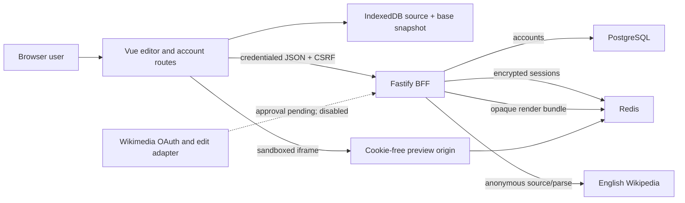

# Architecture

## Purpose and Milestone 2 scope

WikiOne keeps MediaWiki source and a target wiki's compiled article side by
side. Milestone 2 adds first-party accounts, encrypted server sessions, review,
revision preflight, and three-way conflict resolution to the English Wikipedia
MVP. Public Wikimedia OAuth and real wiki writes remain externally gated.

## Implemented topology

The editor never receives parser HTML in API JSON. The BFF stores a complete
preview document under a random ID and returns only its expiring URL. The
preview application remains unable to authenticate or publish.

## Workspace boundaries

The workspace has thirteen independently buildable projects:

- `apps/web`: split editor, local drafts, account/connected-app/privacy routes,
  and publish review/conflict UI.
- `apps/api`: read-only MediaWiki BFF, first-party account routes, revision
  preflight, OpenAPI, OAuth placeholders, and the disabled publish route.
- `apps/preview`: cookie-free opaque-bundle server.
- `apps/render-spike`: pinned live fidelity fixtures.
- `packages/auth-core`: password policy/hashing, session cryptography, and
  account/session transitions.
- `packages/auth-store`: PostgreSQL/Redis plus in-memory test adapters.
- `packages/publishing-core`: bounded line diff, three-way merge, provider error
  mapping, create/update safeguards, and revision verification.
- `packages/wikitext-editor`: independent wikitext language layer.
- `packages/editor-core`: draft identity/base snapshot and preview coordinator.
- `packages/contracts`: runtime wire schemas.
- `packages/mediawiki`: HTTPS-only anonymous Action API client.
- `packages/preview-document`: Vector 2022 article shell and ResourceLoader.
- `packages/preview-store`: Redis/in-memory opaque preview bundles.

## First-party account sequence

1. Registration validates bounded identity fields and password policy.
2. The API derives a per-password salted scrypt hash and commits the account to
   PostgreSQL under a normalized-username unique constraint.
3. A random 256-bit cookie token is HMACed for Redis lookup. The session payload
   is encrypted and authenticated with AES-256-GCM under a versioned key ID.
4. The browser receives only an HTTP-only cookie plus a separate synchronizer
   CSRF value in JSON.
5. Exact Origin and CSRF checks protect mutations. Refresh atomically retires
   the old token; replay revokes the session family.
6. Idle expiry is 30 minutes and absolute expiry is eight hours. Logout,
   logout-all, password change, and deletion revoke the relevant sessions.

WikiOne account identity is never a Wikimedia identity. The connected-app page
shows both states independently.

## Review and conflict sequence

1. IndexedDB retains the base source/revision and current source locally.
2. `publishing-core` generates a text-only bounded line diff. Vue interpolation,
   `<ins>`, and `<del>` render it without HTML insertion.
3. The user supplies a summary, minor flag, and watchlist choice; a current
   compiled preview is required.
4. `/v1/publish/prepare` anonymously reloads the current revision and classifies
   create, update, page creation/deletion, or revision change.
5. The browser merges base, draft, and latest text. Non-overlapping edits merge
   automatically; every overlapping region requires mine/latest/manual choice.
6. Applying a resolution updates the editor, base snapshot, local draft, and
   ordinary preview pipeline. The user reviews again.
7. The final Wikimedia button is disabled and `/v1/publish` cannot write.

The provider port and fake tests already enforce `createonly`-equivalent intent,
base guards for update, and exact post-write source verification. Enabling a
network adapter is a later approval-controlled change.

## Storage and observability

- IndexedDB: wiki/title, current wikitext, exact base wikitext/revision, and
  update time. No credentials or parser HTML.
- PostgreSQL: account ID, username/normalized username, display name, salted
  password hash, and timestamps. No email in this version.
- Redis auth keys: HMAC lookup/index keys and AES-GCM session envelopes with TTL.
- Redis preview keys: rendered HTML and expiry under an unrelated prefix.
- Source-bearing request logging is disabled. Logs may contain request ID and a
  normalized failure code, never titles, source, summaries, identities,
  passwords, cookies, tokens, or session contents.

Compose persists PostgreSQL account data and deliberately does not persist
Redis previews or sessions.

## Deployment boundary

Public deployment requires separate HTTPS editor/API and preview origins,
private PostgreSQL/Redis networking, unique managed session keys, `Secure`
cookies, backups/retention policy, a monitored User-Agent/contact, and shared
rate limiting. Public Wikimedia functionality additionally requires consumer
approval, secret storage, callback validation, token encryption, and a new
security/privacy audit.
