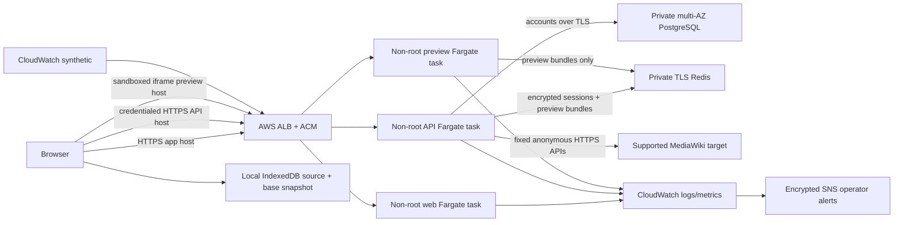
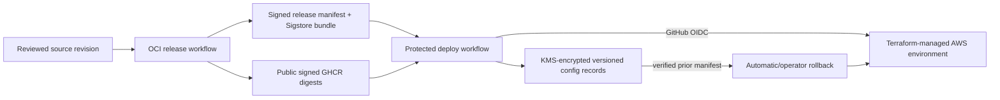

# Architecture

## Public-beta scope

WikiOne is a source-first MediaWiki editor with continuous target rendering,
local drafts, first-party accounts, and read-only publication preparation for an
English Wikipedia MVP. Wikimedia OAuth and upstream edits remain deliberately
disabled pending consumer approval and a separately reviewed adapter.

## Runtime topology

Only the ALB is internet-facing. It redirects exact known hosts from HTTP to
HTTPS, rejects unknown hosts, and routes three separate TLS names. Tasks have no
public IPs. Workload security groups allow ALB-to-service ports, API-to-RDS,
API/preview-to-Redis, and TLS-only outbound access needed for AWS, public GHCR,
and fixed target APIs.

Target parser HTML never enters the editor DOM or API JSON. The API stores a
complete preview document under a random opaque ID in Redis and returns only an
expiring preview-origin URL. The preview service has no account, OAuth, source
loading, or publishing route and receives no API cookie.

## Release and deployment control plane

The release workflow scans source/images, publishes SBOM/provenance evidence,
signs all three image digests, and signs a minimal manifest binding version,
source revision, publication time, and image references. The deployment workflow
proves anonymous image access, verifies signatures, checks out the bound source,
plans exact digests, and assumes an environment-scoped AWS role with OIDC.

Staging `canary` must succeed before production `promote`; production verifies a
byte-identical signed staging manifest. ECS circuit breakers handle readiness
failure. Apply or public-probe failure restores all three prior image references.
Successful plans, hashes, manifests, bundles, deployment records, and the
last-known-good pointer enter versioned KMS-encrypted configuration storage.

## Workspace boundaries

The workspace has fourteen independently buildable projects:

- `apps/web`: split editor, local drafts, account/connected-app/privacy routes,
  and publication review/conflict UI.
- `apps/api`: read-only MediaWiki BFF, first-party account routes, revision
  preflight, OpenAPI, OAuth placeholders, and disabled publication route.
- `apps/preview`: cookie-free opaque-bundle server.
- `apps/render-spike`: controlled target fidelity/compatibility fixtures.
- `packages/auth-core`: password hashing, session cryptography, and transitions.
- `packages/auth-store`: PostgreSQL/Redis plus in-memory test adapters.
- `packages/contracts`: runtime wire schemas.
- `packages/editor-core`: draft identity/base snapshot and preview coordinator.
- `packages/mediawiki`: HTTPS-only anonymous Action API client.
- `packages/preview-document`: Vector-style target document shell and resources.
- `packages/preview-store`: Redis/in-memory opaque preview bundles.
- `packages/publishing-core`: bounded diff, merge, preflight, and provider port.
- `packages/redis-auth`: rotating ElastiCache IAM SigV4 credentials provider.
- `packages/wikitext-editor`: independently implemented language tooling.

## Configuration and identity flows

The release web image is target-neutral. At task start a shell boundary validates
the exact HTTPS API/preview origins, Nginx renders CSP from them, and the shell
writes a same-origin runtime configuration file under the writable `/tmp`
volume. The image and root filesystem remain read-only.

RDS manages its master password. Terraform supplies non-secret host/port/name/
user values and ECS injects only the password JSON key; the API constructs and
validates a TLS PostgreSQL URL in memory. Redis passwords/tokens are never stored:
API and preview task roles have separate key-scoped ElastiCache users, sign
15-minute tokens, reauthenticate every ten minutes, and retry transient signing
failures before expiry.

First-party registration derives a salted scrypt password hash and stores the
account in PostgreSQL. A 256-bit cookie token is HMACed for Redis lookup; its
session payload is AES-256-GCM encrypted under a versioned key. The browser gets
an HTTP-only host cookie and separate synchronizer CSRF value. Exact Origin,
Fetch Metadata, CSRF, replay revocation, 30-minute idle expiry, eight-hour
absolute expiry, password change, logout, and deletion controls apply.

WikiOne identity never implies Wikimedia identity. The connected-app page and
API represent them separately.

## Review and conflict flow

1. IndexedDB retains current source plus the exact base source/revision locally.
2. Publication review renders a bounded text-only diff and requires a current
   compiled preview and summary.
3. `/v1/publish/prepare` anonymously reloads the latest fixed-target revision and
   classifies create/update/deletion/revision conflict without writing.
4. Three-way merge automatically combines non-overlapping changes and exposes
   every overlap for mine/latest/manual resolution.
5. A resolution returns through ordinary draft/preview/review flow.
6. The final Wikimedia action remains disabled and `/v1/publish` cannot edit.

The provider port has fake tests for create-only intent, revision-bound updates,
post-write source verification, and normalized AbuseFilter/CAPTCHA failures. No
network write adapter is installed.

## Storage, retention, and observability

| Store                       | Content                                                    | Backup policy                  |
| --------------------------- | ---------------------------------------------------------- | ------------------------------ |
| Browser IndexedDB           | current/base wikitext, revision, timestamp                 | never server-backed up         |
| PostgreSQL                  | account identity, salted password hash, timestamps         | encrypted 7–35 day retention   |
| Redis auth prefix           | HMAC indexes and encrypted session envelopes               | ephemeral; never backed up     |
| Redis preview prefix        | opaque rendered documents with short TTL                   | ephemeral; never backed up     |
| Terraform state bucket      | encrypted/versioned infrastructure state                   | separate operator-owned bucket |
| Configuration record bucket | signed manifests/bundles, plans/hashes, deployment records | KMS encrypted and versioned    |

Request logs contain bounded method, route template, status, duration, and
request ID only. They exclude addresses, bodies, titles, source, summaries,
identities, credentials, cookies, tokens, parser output, and upstream bodies.

CloudWatch covers readiness, target/application 5xx, p95 latency, running tasks,
unexpected task stops, authentication rejection pressure, RDS/Redis health,
certificate expiry, RDS operational events, and synthetic public readiness.

## Unfulfilled external state

The repository contains deployable code, not proof of a live service. Public
beta still requires owner AWS/DNS/secrets, protected environment approvals,
public GHCR artifacts, real TLS/domain probes, confirmed alert delivery,
configuration and RDS restore evidence, canary/rollback exercises, manual
assistive-technology sign-off, a monitored private security contact, and an
explicit MIT/GPL governance decision.
