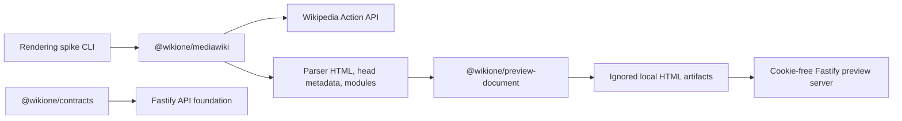

# Architecture

## Purpose

WikiOne will be a standalone MediaWiki editor that keeps source code and the
target wiki's rendered article side by side. Milestone 0 establishes the
interfaces and proves that target-generated HTML and ResourceLoader modules can
be assembled into an isolated document without copying untrusted markup into the
editor origin.

## Current Milestone 0 system

The workspace has five independently buildable projects:

- `apps/api`: backend-for-frontend foundation with health, contract metadata,
  and generated OpenAPI 3.1.
- `apps/render-spike`: pinned fixture renderer, structural fidelity validator,
  and isolated local preview server.
- `packages/contracts`: runtime-validated request and response schemas.
- `packages/mediawiki`: server-side Action API client with explicit User-Agent,
  `maxlag`, timeouts, and structured errors.
- `packages/preview-document`: deterministic article shell, safe `headhtml`
  metadata extraction, ResourceLoader bootstrapping, and preview CSP.

## Request and rendering flow

1. A fixture identifies either an immutable Wikipedia revision or a controlled
   local wikitext source file.
2. The MediaWiki client retrieves site metadata and, for pinned fixtures, the
   exact revision source.
3. The client sends wikitext to `action=parse` with preview/article options,
   Vector 2022, and requested HTML/head/module/config/warning properties.
4. The preview builder reads only language, direction, and body classes from
   `headhtml`. Raw head scripts and links are not copied.
5. The builder reconstructs the article shell, loads parser-declared styles and
   scripts, removes user-specific `user`, `user.options`, and `user.styles`
   modules, and preserves target parser HTML in the isolated document.
6. Generated HTML and a metadata-only manifest are written beneath the ignored
   `artifacts/` directory.
7. The preview server serves only manifest-listed files, without cookies, using
   restrictive CSP, permissions, referrer, cache, and content-type headers.

## Planned production topology

Milestone 1 and later will retain these package boundaries while adding a Vue
editor at `editor.example`, same-origin BFF routes, Redis-backed ephemeral
sessions/render bundles, and `preview.editor.example` as a distinct origin. The
preview service will have no OAuth or publishing endpoints. Target hosts will
come from a fixed Wikimedia site registry rather than user-provided URLs.

The provider interface will expose site discovery, title search, source loading,
editor configuration, parsing, delegated authentication, CSRF acquisition, and
publishing. Wikipedia is the first implementation. Moegirlpedia remains a later
provider whose authentication and extension capabilities must be certified with
its operator before writes are enabled.

## Storage

Milestone 0 stores no accounts, OAuth tokens, or server drafts. Generated
artifacts are local, ignored, reproducible, and may be deleted at any time.
Milestone 1 browser drafts will use IndexedDB. Later OAuth sessions and render
bundles will use Redis with encrypted token payloads and short-lived opaque IDs;
there is no relational database in the single-user MVP.

## Observability boundary

The MediaWiki client intentionally has no source-aware logging callback. Future
logs may contain request IDs, selected wiki IDs, byte counts, durations, and
normalized upstream codes, but never page titles, wikitext, parser HTML, edit
summaries, credentials, or OAuth tokens.
