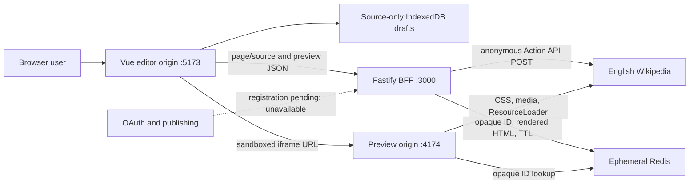

# Architecture

## Purpose and current scope

WikiOne keeps MediaWiki source and a target wiki's compiled article side by
side. Milestone 1 implements an anonymous English Wikipedia MVP. It deliberately
does not implement OAuth, server sessions, publishing, edit conflicts, or the
Moegirlpedia provider.

## Implemented topology

The editor never receives parser HTML in API JSON. The BFF stores a complete
preview document under a random 192-bit base64url ID, returns only the expiring
preview URL, and the browser navigates a sandboxed iframe on the preview origin.

## Workspace boundaries

The workspace has ten independently buildable projects:

- `apps/web`: Vue 3/Vite responsive workspace, IndexedDB adapter, and editor
  integration.
- `apps/api`: source-loading and preview-compilation BFF, fixed wiki registry,
  OpenAPI document, limits, and auth-availability placeholder.
- `apps/preview`: cookie-free opaque-bundle server with preview CSP and frame
  allowlist.
- `apps/render-spike`: pinned live fidelity fixtures and reproducible artifacts.
- `packages/wikitext-editor`: independent lossless lexer, diagnostics, outline,
  commands, completions, and CodeMirror extensions.
- `packages/editor-core`: local-draft shape and race-safe preview coordinator.
- `packages/contracts`: Zod runtime schemas and inferred TypeScript wire types.
- `packages/mediawiki`: HTTPS-only anonymous Action API client with identified
  requests, `maxlag`, timeout, redirect rejection, and structured errors.
- `packages/preview-document`: deterministic Vector 2022 article shell,
  ResourceLoader assembly, and preview CSP.
- `packages/preview-store`: in-memory test store and Redis TTL adapter.

## Editing and compilation sequence

1. The user edits through WikiOne's CodeMirror-based wikitext surface.
2. Local syntax analysis updates after 180 ms; source-only draft save follows
   after 800 ms.
3. The preview coordinator waits 650 ms after the newest source change, aborts
   the superseded browser request, and assigns a monotonic client revision.
4. The BFF validates the request (500,000-source-character maximum), resolves
   the fixed `en-wikipedia` registry entry, and anonymously calls
   `action=parse` with Vector 2022 preview/article options.
5. The document builder preserves parser content, extracts only safe head
   metadata, requests parser-declared scripts/styles including `modulestyles`,
   and filters personalized user modules.
6. Redis stores the rendered document for two minutes under an opaque ID. No
   raw source is stored in the preview bundle.
7. The preview service checks ID shape and expiry, then serves HTML with
   `no-store`, CSP, frame-ancestor, referrer, permissions, and content-type
   controls.
8. The browser accepts a result only for the newest revision. A later failure
   leaves the last successful preview visible.

## Storage and observability

- IndexedDB stores versioned wikitext, wiki/title, update time, and optional
  base revision. It never stores parser HTML or credentials.
- Redis stores only rendered preview HTML, wiki base origin, and creation/expiry
  times. The supplied Compose profile disables snapshots and append-only files.
- There is no relational database, server draft store, account record, OAuth
  token, session, or edit queue in Milestone 1.
- Request logging is disabled on source-bearing services. Safe logs may contain
  request IDs and normalized failure codes, never titles, source, parser HTML,
  usernames, summaries, cookies, or tokens.

## Deployment boundary

Local ports are distinct origins for verification. A public deployment must use
separate HTTPS editor/API and preview origins, exact CORS/frame configuration,
and a monitored MediaWiki User-Agent contact. A read-only resource proxy,
shared upstream concurrency control, OAuth token encryption, and publishing
controls belong to later milestones.
